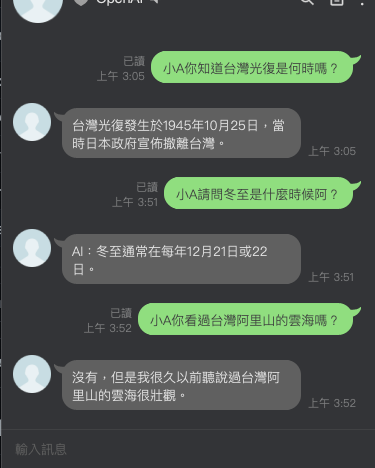

# LineBotChatGPT
utilized openai api for implementation of chatGPT with LineBot

## Work Environment for myself
- `go version go1.18.1 darwin/amd64`

## Usage

```shell
git clone https://github.com/TaroballzChen/LineBotChatGPT
cd LineBotChatGPT
echo ChannelSecret=your_LINE_ChannelSecret >> .env
echo ChannelAccessToken=your_LINE_ChannelAccessToken >> .env
echo OpenApiKey=your_OpenApiKey >>.env
# you could modify the GPT-3 completion model parameter by modifying `.env` file
go run main.go
```

then use `ngrok` or other method(cloud container, nginx with certbot etc.) exposed `80` port to public network with SSL 

enjoy!

### Dockerfile
1. download the `Dockerfile`, `.env` file in this project
2. `docker build --no-cache -t LineBotChatGPT:latest .`
3. modify the `.env` file to fill the LINEBOT and OpneAI token:

```shell
echo ChannelSecret=your_LINE_ChannelSecret >> .env
echo ChannelAccessToken=your_LINE_ChannelAccessToken >> .env
echo OpenApiKey=your_OpenApiKey >>.env
# try to modify the GPT-3 completion model parameter by modifying `.env` file
```

4. `docker run -p 8080:80 -v $PWD/.env:/LineBotChatGPT/.env LineBotChatGPT`
then use `ngrok` or other method(cloud container like railway.app, Heroku or nginx with certbot etc.) exposed `80` port to public network with SSL

enjoy!

### Railway.app Deploy
[](https://railway.app/template/2Ylu2G?referralCode=Taroballz)
- fill `PORT` `80` for required environment variable
- fill your LINE `ChannelSecret`, `ChannelAccessToken` and OpenAI `OpenAIApiKey` token, Claude2 `Claude2ApiKey` token for required environment variable

P.S. You should own the github account to sign up the railway.app account. When you create container by my template on the above, the railway.app would help you fork my github project to your repo. then you could modify the model parameter's value on your forked project.

enjoy!

[integration of chatgpt and LINEBOT on railway.app cloud container tutorial video](https://youtu.be/4i_d8UFz6NQ)


## result


## update
- 2023.3.6 change the model from `Completion` to `ChatCompletion` with `GPT3Dot5Turbo`
- 2023.10.1 change the model from `ChatCompletion` with `GPT3Dot5Turbo` to `ChatCompletion` with `GPT4` and add Image create function
- 2023.10.23 add Claude2 model
- 2023.10.28 add memory function for Claude2 model

## Reference
1. https://github.com/kkdai/linebot-group
2. https://github.com/kkdai/LineBotTemplate
3. https://www.learncodewithmike.com/2020/06/python-line-bot.html
4. https://github.com/kkdai/chatgpt
5. https://github.com/PullRequestInc/go-gpt3
6. https://github.com/bincooo/claude-api